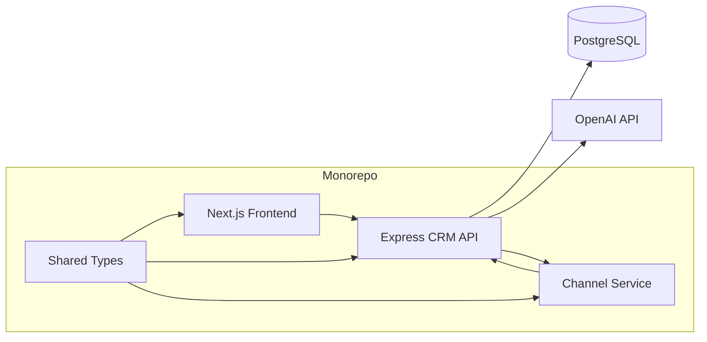

# Xeno Mini CRM

AI-native mini CRM for shopper segmentation, personalized campaigns, simulated delivery, and performance analytics.

## Product Overview

- Ingests customers and orders into PostgreSQL via Prisma.
- Builds manual and AI-assisted shopper segments.
- Creates campaigns with AI-generated copy, channel recommendation, and live previews.
- Simulates delivery through a separate channel service with async callbacks and retry logic.
- Tracks campaign performance with real API-backed analytics and Recharts.

## Architecture



## Repo Structure

- `apps/frontend` - Next.js 14 App Router UI
- `apps/backend` - Express + Prisma CRM API
- `apps/channel-service` - simulated delivery worker
- `packages/shared-types` - shared TypeScript contracts

## AI Usage

- Segment text is converted into structured Prisma-friendly filters.
- Campaign copy is generated per goal, audience, and channel.
- Channel recommendation is generated from campaign intent and segment context.
- AI is server-side only and isolated behind `apps/backend/src/ai`.

If `OPENAI_API_KEY` is not set, the backend falls back to deterministic heuristic parsing so the app still works locally.

## Tradeoffs & Scope Decisions

- Channel delivery is simulated instead of integrating real providers.
- Analytics are computed from persisted message records, not mocked on the client.
- The segment engine focuses on a compact filter DSL that maps cleanly to Prisma.
- OpenAI output is parsed as JSON and falls back safely when unavailable or malformed.

## Local Setup

1. Install dependencies:
   ```bash
   npm install
   ```
2. Configure env files:
   - `apps/backend/.env`
   - `apps/channel-service/.env`
   - `apps/frontend/.env.local`
3. Push the schema and seed demo data:
   ```bash
   npm run db:setup
   ```
4. Start the services:
   ```bash
   npm run dev:backend
   npm run dev:channel
   npm run dev:frontend
   ```

## Deployment

Recommended path for the demo:

- Frontend: Vercel
- Backend: Render web service
- Channel service: Render web service
- PostgreSQL: Neon, Supabase, Railway Postgres, or Render Postgres

### 1. Push the repo to GitHub

Both Vercel and Render deploy cleanly from GitHub. Make sure `.env` files are not committed.

### 2. Create a hosted PostgreSQL database

Create a Postgres database and copy the pooled or direct connection string. Use it as `DATABASE_URL` for the backend.

### 3. Deploy Backend and Channel Service on Render

This repo includes `render.yaml`, so the fastest route is Render Blueprint:

1. In Render, create a new Blueprint from this GitHub repo.
2. Render creates:
   - `xeno-mini-crm-backend`
   - `xeno-mini-crm-channel`
3. Add backend secrets when prompted:
   - `DATABASE_URL`
   - `OPENAI_API_KEY`
4. After the services are created, confirm these backend env vars match the actual Render URLs:
   - `API_BASE_URL=https://xeno-mini-crm-backend-l8ff.onrender.com`
   - `CHANNEL_SERVICE_URL=https://xeno-mini-crm-channel.onrender.com`
5. If Render changes either subdomain, update the env vars and redeploy the backend.

Render commands used by the blueprint:

```bash
npm ci && npm run build:backend
npm run db:deploy
npm run start:backend
```

```bash
npm ci && npm run build:channel
npm run start:channel
```

### 4. Seed Production Demo Data

After the backend deploy succeeds, run a one-off job or shell command on the backend service:

```bash
npm run db:seed
```

Use this once for the demo database. Re-running it resets demo customers, orders, segments, campaigns, and messages.

### 5. Deploy Frontend on Vercel

Import the same GitHub repo into Vercel as a monorepo project:

- Framework preset: `Next.js`
- Root directory: `apps/frontend`
- Build command: `npm run build`
- Install command: auto-detected
- Output directory: auto-detected

Set this Vercel environment variable:

```bash
NEXT_PUBLIC_API_BASE_URL=https://xeno-mini-crm-backend-l8ff.onrender.com
```

Replace the URL if Render generated a different backend domain.

### 6. Smoke Test Production

Open these URLs:

```bash
https://xeno-mini-crm-backend-l8ff.onrender.com/health
https://xeno-mini-crm-channel.onrender.com/health
```

Then test the product flow from the Vercel URL:

1. Open Customers and verify seeded shoppers load.
2. Create an AI segment.
3. Create a campaign from that segment.
4. Launch the campaign.
5. Wait a few seconds, then open Analytics and confirm message stats update.

### Railway Alternative

Railway can also deploy this as a shared npm workspace monorepo. Create two services from the same repo and keep the repo root as the build context:

- Backend build command: `npm ci && npm run build:backend`
- Backend start command: `npm run start:backend`
- Channel build command: `npm ci && npm run build:channel`
- Channel start command: `npm run start:channel`

Set the same backend env vars listed above. Run `npm run db:deploy` and `npm run db:seed` from the backend service after the database is attached.

## Environment Variables

### Backend

- `DATABASE_URL`
- `OPENAI_API_KEY`
- `OPENAI_MODEL`
- `CRM_WEBHOOK_SECRET`
- `CHANNEL_SERVICE_URL`
- `API_BASE_URL`
- `PORT`

### Channel Service

- `PORT`
- `CRM_WEBHOOK_SECRET`

### Frontend

- `NEXT_PUBLIC_API_BASE_URL`

## Demo Flow

1. Open the dashboard and review live analytics.
2. Browse customers and inspect order history.
3. Build a manual or AI-assisted segment.
4. Create a campaign, generate copy, and pick a channel.
5. Launch the campaign and watch the simulated delivery flow update the CRM.
6. Return to analytics to see the funnel change from real receipts.

## Deployment URLs

- Frontend: `https://xeno-crm-frontend-ochre.vercel.app`
- Backend: `https://xeno-mini-crm-backend-l8ff.onrender.com`
- Channel service: `https://xeno-mini-crm-channel.onrender.com`

If any service is redeployed under a new domain, update the matching environment variables before demoing.
