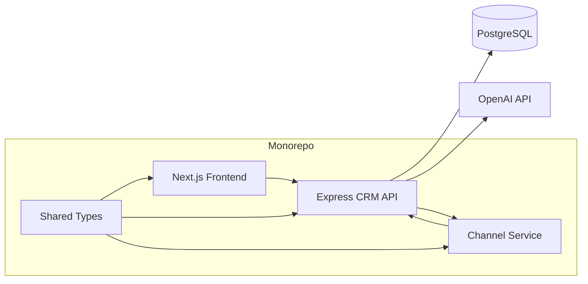

# Xeno Mini CRM

AI-native mini CRM for shopper segmentation, personalized campaigns, simulated delivery, and performance analytics.

## Product Overview

- Ingests customers and orders into PostgreSQL via Prisma.
- Builds manual and AI-assisted shopper segments.
- Creates campaigns with AI-generated copy, channel recommendation, and live previews.
- Simulates delivery through a separate channel service with async callbacks and retry logic.
- Tracks campaign performance with real API-backed analytics and Recharts.

## Architecture



## Repo Structure

- `apps/frontend` - Next.js 14 App Router UI
- `apps/backend` - Express + Prisma CRM API
- `apps/channel-service` - simulated delivery worker
- `packages/shared-types` - shared TypeScript contracts

## AI Usage

- Segment text is converted into structured Prisma-friendly filters.
- Campaign copy is generated per goal, audience, and channel.
- Channel recommendation is generated from campaign intent and segment context.
- AI is server-side only and isolated behind `apps/backend/src/ai`.

If `OPENAI_API_KEY` is not set, the backend falls back to deterministic heuristic parsing so the app still works locally.

## Tradeoffs & Scope Decisions

- Channel delivery is simulated instead of integrating real providers.
- Analytics are computed from persisted message records, not mocked on the client.
- The segment engine focuses on a compact filter DSL that maps cleanly to Prisma.
- OpenAI output is parsed as JSON and falls back safely when unavailable or malformed.

## Local Setup

1. Install dependencies:
   ```bash
   npm install
   ```
2. Configure env files:
   - `apps/backend/.env`
   - `apps/channel-service/.env`
   - `apps/frontend/.env.local`
3. Push the schema and seed demo data:
   ```bash
   npm run db:setup
   ```
4. Start the services:
   ```bash
   npm run dev:backend
   npm run dev:channel
   npm run dev:frontend
   ```

## Environment Variables

### Backend

- `DATABASE_URL`
- `OPENAI_API_KEY`
- `OPENAI_MODEL`
- `CRM_WEBHOOK_SECRET`
- `CHANNEL_SERVICE_URL`
- `API_BASE_URL`
- `PORT`

### Channel Service

- `PORT`
- `CRM_WEBHOOK_SECRET`

### Frontend

- `NEXT_PUBLIC_API_BASE_URL`

## Demo Flow

1. Open the dashboard and review live analytics.
2. Browse customers and inspect order history.
3. Build a manual or AI-assisted segment.
4. Create a campaign, generate copy, and pick a channel.
5. Launch the campaign and watch the simulated delivery flow update the CRM.
6. Return to analytics to see the funnel change from real receipts.

## Deployment URLs

- Frontend: `https://your-vercel-app.vercel.app`
- Backend: `https://your-render-or-railway-api.onrender.com`
- Channel service: `https://your-render-or-railway-channel.onrender.com`

Replace these placeholders with your actual deployment URLs and update the environment variables accordingly.
